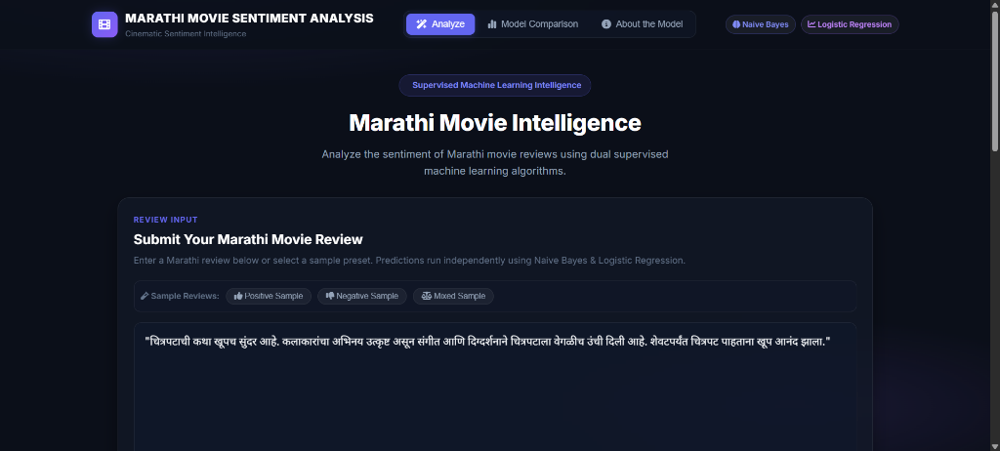
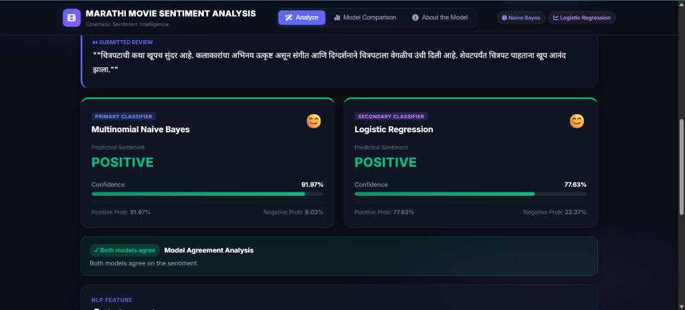
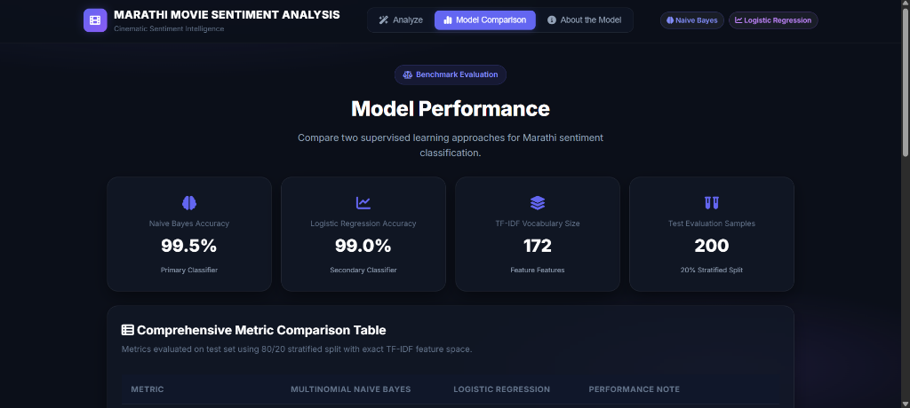
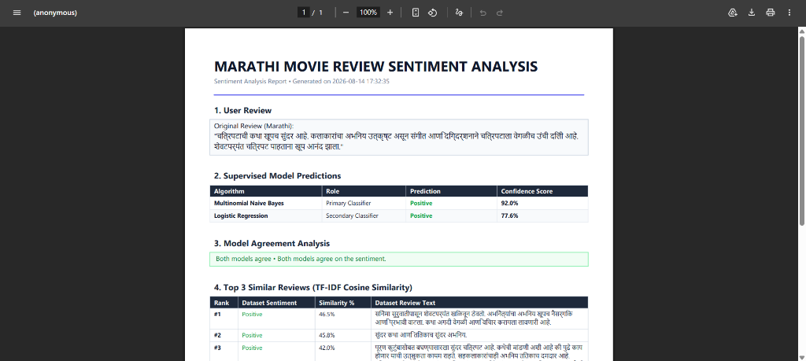

# MarathiSense AI — Marathi Movie Review Sentiment Analysis

An advanced dual-supervised machine learning web application for **Marathi movie review sentiment analysis**, built with Python, Flask, Scikit-Learn, word + character TF-IDF feature combination, **Multinomial Naive Bayes**, and **Logistic Regression**.

The system features context-aware **Marathi negation handling**, **contrastive structure detection**, **confidence explainability**, **test-set error analysis**, and **cosine similarity search**.

---

## 📷 Screenshots & Interface Showcase

### 1. Review Input & Main Dashboard
Enter Marathi movie reviews or select sample review presets to initiate analysis.



---

### 2. Dual Independent Predictions & Model Agreement
Independent predictions from **Multinomial Naive Bayes** (Primary) and **Logistic Regression** (Secondary) alongside dual-class probability distributions, confidence difference, and agreement status.



---

### 3. Model Performance Benchmark Comparison & Error Analysis
Interactive comparison view displaying test set evaluation metrics (Accuracy, Precision, Recall, F1 Score, Confusion Matrices), negation diagnostic benchmarks, and real test-set misclassification error analysis.



---

### 4. Downloadable PDF Analysis Report
Export complete sentiment analysis reports in PDF format with native Devanagari font rendering (`Nirmala.ttc`), confusion matrices, feature evidence, and methodology explanations.



---

## 📁 Project Structure

```
project/
│
├── dataset/
│   └── marathi_movie_reviews_6000_negation_hardcases.csv  # 6,000 balanced Marathi reviews
│
├── docs/
│   └── images/                         # Dashboard & PDF screenshots
│       ├── review_input.png
│       ├── dual_model_predictions.png
│       ├── model_performance_comparison.png
│       └── pdf_analysis_report.png
│
├── models/
│   ├── sentiment_model.pkl             # Multinomial Naive Bayes model
│   ├── logistic_regression_model.pkl   # Logistic Regression model
│   ├── word_vectorizer.pkl             # Word TF-IDF vectorizer (1-2 grams)
│   ├── char_vectorizer.pkl             # Char TF-IDF vectorizer (3-5 char_wb)
│   ├── tfidf_vectorizer.pkl            # Bundled vectorizers package
│   └── metrics.json                    # Saved 1,200 test set evaluation metrics & error analysis
│
├── templates/
│   └── index.html                      # Cinematic dark mode dashboard (Analyze, Model Comparison)
│
├── static/
│   ├── style.css                       # Responsive CSS styles & glassmorphism
│   └── script.js                       # Tab navigation & frontend interaction
│
├── preprocess.py                       # Devanagari cleaning, negation tagging & contrast preservation
├── train_model.py                      # Dual-feature ML training, evaluation & error analysis pipeline
├── predict.py                          # Dual-model prediction engine, explainability & Cosine Similarity
├── pdf_generator.py                    # PDF report builder using ReportLab with Devanagari typography
├── app.py                             # Flask web app & REST API endpoints
├── test_workflow.py                    # End-to-end automated verification test suite
├── requirements.txt                    # Project dependencies
└── README.md                           # Project documentation
```

---

## 📊 Dataset Overview

- **Dataset File:** `dataset/marathi_movie_reviews_6000_negation_hardcases.csv`
- **Total Reviews:** 6,000
- **Class Balance:** 3,000 Positive / 3,000 Negative (50.0% / 50.0%)
- **Duplicate Reviews:** 0
- **Hard Cases:** Contains 1,000 dedicated difficult reviews covering:
  - Marathi negation (`नाही`, `नव्हता`, `नव्हती`, `नव्हते`, `नको`, `नसून`)
  - Negative-looking vocabulary with positive meaning (e.g., *"हा चित्रपट वाईट नाही"*)
  - Positive-looking vocabulary with negative meaning (e.g., *"अभिनय उत्कृष्ट वाटला नाही"*)
  - Contrastive conjunctions (`पण`, `मात्र`, `तरी`, `उलट`, `परंतु`)
  - Mixed sentiment transitions (first-half negative $\rightarrow$ second-half positive and vice versa)

---

## 🧠 Machine Learning Architecture

```text
Raw Marathi Review
        ↓
Devanagari Normalization & Unicode Filtering (U+0900–U+097F)
        ↓
Context-Aware Negation Tagging (_NEG) & Phrase Normalization (NOT_BAD, NOT_GOOD, etc.)
        ↓
 ┌──────────────────────────────────────┬──────────────────────────────────────┐
 │ Word TF-IDF Vectorizer               │ Character TF-IDF Vectorizer          │
 │ (1–2 n-grams, sublinear_tf=True)     │ (3–5 char_wb, sublinear_tf=True)     │
 │ 3,237 vocabulary features            │ 5,961 vocabulary features            │
 └──────────────────────────────────────┴──────────────────────────────────────┘
        ↓                                      ↓
      Combined Sparse Feature Matrix (scipy.sparse.hstack: 9,198 features)
        ↓
 ┌──────────────────────────────────────┬──────────────────────────────────────┐
 │ Multinomial Naive Bayes              │ Logistic Regression                  │
 │ (alpha=1.0)                          │ (max_iter=2000, random_state=42)     │
 └──────────────────────────────────────┴──────────────────────────────────────┘
        ↓                                      ↓
   predict_proba()                        predict_proba()
 (P(Pos) + P(Neg) = 100%)               (P(Pos) + P(Neg) = 100%)
```

---

## 📈 Real Test-Set Evaluation Results (1,200 Unseen Reviews)

Evaluated strictly on an 80/20 stratified test split (4,800 train / 1,200 test, `random_state=42`):

| Evaluation Metric | Multinomial Naive Bayes | Logistic Regression | Evaluation Description |
| :--- | :---: | :---: | :--- |
| **Accuracy** | **97.50%** | **98.92%** | Overall correct test set classifications |
| **Precision** | **99.48%** | **99.66%** | Positive class predictive precision |
| **Recall** | **95.50%** | **98.17%** | Sensitivity to positive sentiment |
| **F1 Score** | **97.45%** | **98.91%** | Harmonic mean of precision and recall |
| **Confusion Matrix** | `[[597, 3], [27, 573]]` | `[[598, 2], [11, 589]]` | `[TN, FP]` (Negative) / `[FN, TP]` (Positive) |

---

## 🎯 Negation & Contrast Diagnostic Benchmark

Both models were evaluated on critical Marathi diagnostic expressions without hardcoded rules:

| Diagnostic Review Expression | Category | Expected | Naive Bayes Output | Logistic Regression Output |
| :--- | :--- | :--- | :--- | :--- |
| `"हा चित्रपट वाईट नाही."` | Negation Positive | **Positive** | **Positive** (100.0% Pos, 0.0% Neg) | **Positive** (91.9% Pos, 8.1% Neg) |
| `"कथा अजिबात कंटाळवाणी नाही."` | Negation Positive | **Positive** | **Positive** (100.0% Pos, 0.0% Neg) | **Positive** (93.5% Pos, 6.5% Neg) |
| `"चित्रपटाने निराश केले नाही."` | Negation Positive | **Positive** | **Positive** (100.0% Pos, 0.0% Neg) | **Positive** (97.2% Pos, 2.8% Neg) |
| `"हा चित्रपट चांगला नाही."` | Negation Negative | **Negative** | **Negative** (100.0% Neg, 0.0% Pos) | **Negative** (81.1% Neg, 18.9% Pos) |
| `"अभिनय उत्कृष्ट वाटला नाही."` | Negation Negative | **Negative** | **Negative** (100.0% Neg, 0.0% Pos) | **Negative** (84.7% Neg, 15.3% Pos) |
| `"शेवट समाधानकारक नव्हता."` | Negation Negative | **Negative** | **Negative** (94.2% Neg, 5.8% Pos) | Positive (47.3% Neg, 52.7% Pos) |
| `"सुरुवात थोडी कंटाळवाणी आहे, पण पुढे कथा इतकी सुंदर उलगडते आणि क्लायमॅक्स थक्क करून सोडतो."` | Contrast Hard Case | **Positive** | **Positive** (100.0% Pos, 0.0% Neg) | **Positive** (96.2% Pos, 3.8% Neg) |

---

## 🚀 Key Features

1. **Dual Independent Supervised Classifiers**:
   - **Multinomial Naive Bayes** (Primary Classifier)
   - **Logistic Regression** (Secondary Classifier)
   - Predictions and confidence scores derived strictly from `predict_proba()`.
   - Never outputs only winning probability; displays both Positive % and Negative % ($P(\text{Pos}) + P(\text{Neg}) = 100\%$).

2. **Context-Aware Negation & Contrast Handling**:
   - Preserves negation particles and contrastive conjunctions (`पण`, `मात्र`, `तरी`, `उलट`).
   - Normalizes phrase-level negation patterns (`NOT_BAD`, `NOT_GOOD`, `NOT_DISAPPOINTING`).
   - Tags predicates with `_NEG` to capture semantic sentiment inversion without sentence-wide negation corruption.

3. **"Why this score?" Feature Explainability**:
   - Model-derived feature evidence computed from actual mathematical parameters:
     - Naive Bayes: Log likelihood ratio $S_i = \text{TF-IDF}_i \times (\log P(w_i | \text{Positive}) - \log P(w_i | \text{Negative}))$.
     - Logistic Regression: Linear contribution $C_i = \text{TF-IDF}_i \times \text{coef}_i$.
   - Highlights positive ($+$) and negative ($-$) indicator chips present in the review.

4. **Independent Cosine Similarity Search**:
   - Retrieval feature mapping user reviews to the top 3 closest dataset reviews with similarity percentages.
   - Kept completely isolated from classifier predictions (does not vote or alter model confidence).

5. **Test-Set Error Analysis Section**:
   - Live breakdown of misclassifications on 1,200 test samples categorized by linguistic properties (`Negation`, `Contrast`, `Standard`).

6. **Professional Downloadable PDF Reports**:
   - Export analysis reports containing dual predictions, probability distributions, model agreement analysis, feature evidence, top similar reviews, and benchmark evaluation tables.

---

## ⚙️ Setup & Installation

1. **Clone the repository:**

   ```bash
   git clone https://github.com/Clive0707/Cinematic-Sentiment-Analysis.git
   cd Cinematic-Sentiment-Analysis
   ```

2. **Create and activate a virtual environment (recommended):**

   ```bash
   python -m venv venv
   venv\Scripts\activate        # Windows
   source venv/bin/activate     # macOS/Linux
   ```

3. **Install dependencies:**

   ```bash
   pip install -r requirements.txt
   ```

4. **Train the models:**

   ```bash
   python train_model.py
   ```

5. **Run the automated verification suite:**

   ```bash
   python test_workflow.py
   ```

6. **Start the web application:**

   ```bash
   python app.py
   ```

7. **Open in your browser:**

   ```
   http://127.0.0.1:5000
   ```

---

## 📜 License

MIT License
